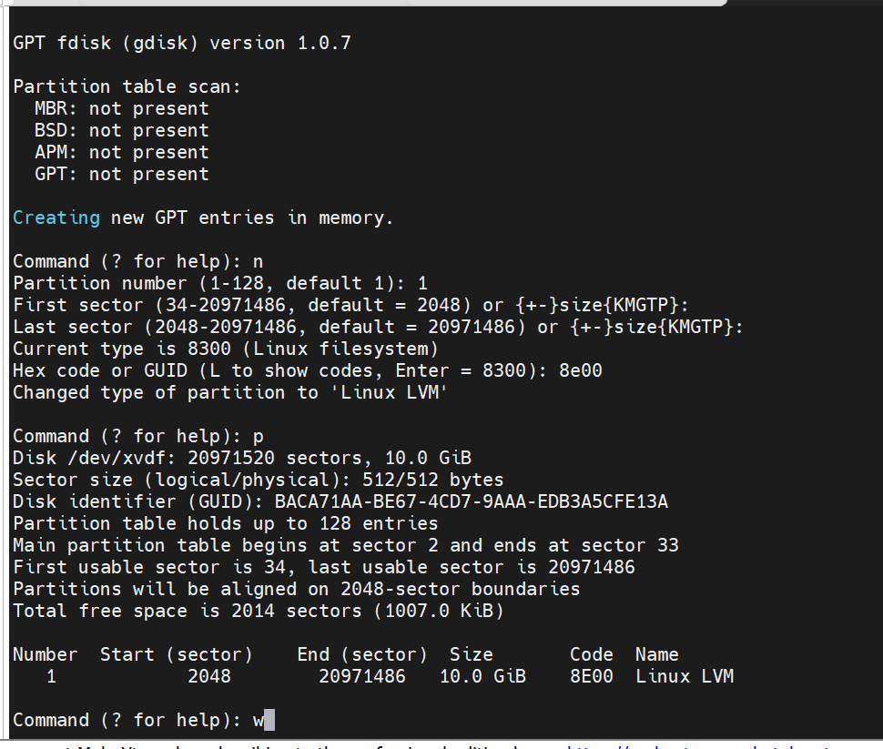
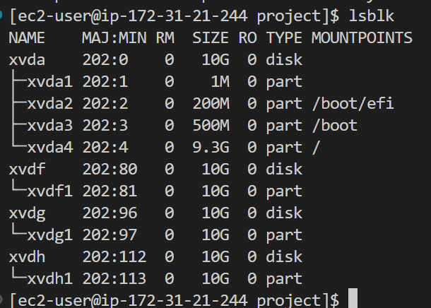
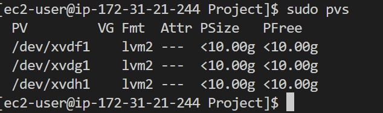
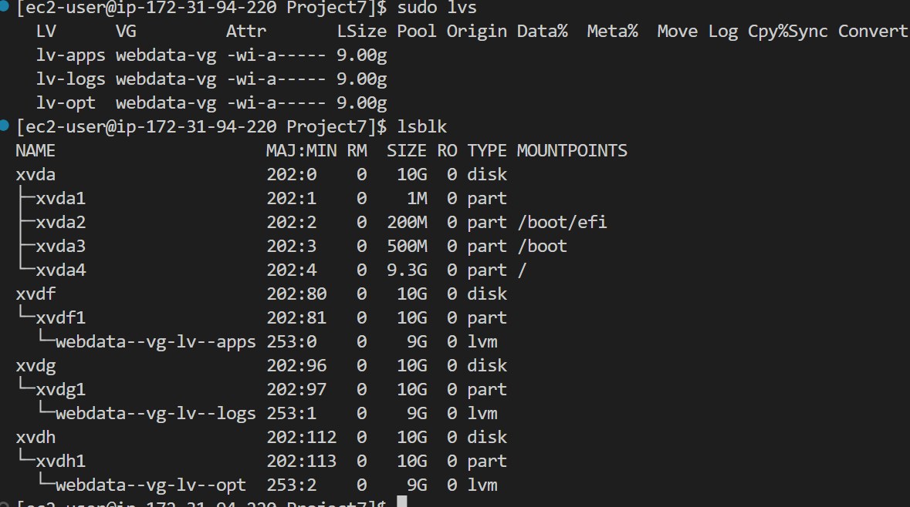
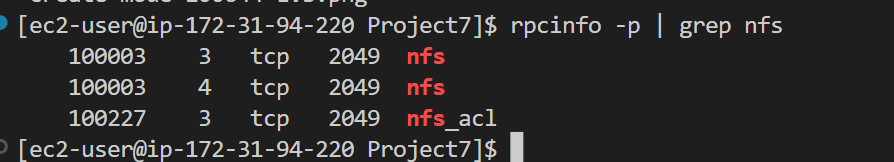
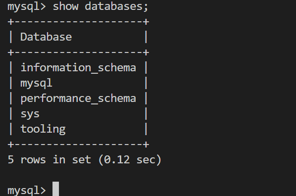

## DEVOPS TOOLING WEBSITE SOLUTION

Step 1 – Prepare NFS Server 
Spin up a new EC2 instance with RHEL Linux 8 Operating System and configure by first partitioning the disk before installing the NFS

We begin by configuring the storage subsystem for NFS servers on Linux OS. This gives us further  practical experience of working with disks, partitions and volumes in Linux.

1.  Create 3 volumes in the same AZ as your NFS Server EC2, each of 10 GiB.

2. Attach all three volumes one by one to your NFS Server EC2 instance

3. Open up the Linux terminal to begin configuration

4.  Use `gdisk` utility to create a single partition on each of the 3 disks

sudo gdisk /dev/xvdf /dev/xvdg /dev/xvdh

4.  Use `lsblk` utility to view the newly configured partition on each of the 3 disks.

5.  Install `lvm2` package using 

sudo yum install lvm2

6.  Run `sudo lvmdiskscan` command to check for available partitions.

7. Use `pvcreate` utility to mark each of 3 disks as physical volumes (PVs) to be used by LVM

sudo pvcreate /dev/xvdf1 /dev/xvdg1 /dev/xvdh1

8. Verify PVs using this command `sudo pvs` 

9. Use `vgcreate` utility to add all 3 PVs to a volume group (VG). Name the VG webdata-vg

sudo vgcreate webdata-vg /dev/xvdh1 /dev/xvdg1 /dev/xvdf1

10. Verify that your VG has been created successfully by running `sudo vgs`

11. Use the `lvcreate` utility to create 3 Logical Volumes lv-opt lv-apps, and lv-logs

sudo lvcreate -n lv-opt -L 9G webdata-vg
sudo lvcreate -n lv-apps -L 9G webdata-vg
sudo lvcreate -n lv-logs -L 9G webdata-vg

12. Verify by running `sudo lvs` and `lsblk`

13. Use `mkfs.xfs` to format the logical volumes with xfs filesystem

sudo mkfs -t xfs /dev/webdata-vg/lv-apps
sudo mkfs -t xfs /dev/webdata-vg/lv-logs
sudo mkfs -t xfs /dev/webdata-vg/lv-opt

14. Create mount points on /mnt directory for the logical volumes as follow:
Mount lv-apps on /mnt/apps – To be used by webservers
Mount lv-logs on /mnt/logs – To be used by webserver logs
Mount lv-opt on /mnt/opt – To be used by Jenkins server in Project 8

so make these directories

sudo mkdir /mnt/apps
sudo mkdir /mnt/logs
sudo mkdir /mnt/opt

15. and mount with these commands

sudo mount /dev/webdata-vg/lv-apps /mnt/apps
sudo mount /dev/webdata-vg/lv-logs /mnt/logs
sudo mount /dev/webdata-vg/lv-opt /mnt/opt

16. Install NFS server, configure it to start on reboot and make sure it is up and running with these commands:-

sudo yum -y update
sudo yum install nfs-utils -y
sudo systemctl start nfs-server.service
sudo systemctl enable nfs-server.service
sudo systemctl status nfs-server.service

17. Make sure to set up permission that will allow the Web servers to read, write and execute files on NFS:

sudo chown -R nobody: /mnt/apps
sudo chown -R nobody: /mnt/logs
sudo chown -R nobody: /mnt/opt

sudo chmod -R 777 /mnt/apps
sudo chmod -R 777 /mnt/logs
sudo chmod -R 777 /mnt/opt
 
 18. And restart NFS with 

sudo systemctl restart nfs-server.service

19. Configure access to NFS for clients within the same subnet :

sudo vi /etc/exports

Paste and save the following commands

/mnt/apps 172.31.80.0/20(rw,sync,no_all_squash,no_root_squash)
/mnt/logs 172.31.80.0/20(rw,sync,no_all_squash,no_root_squash)
/mnt/opt 172.31.80.0/20(rw,sync,no_all_squash,no_root_squash)

Esc + :wq!

20. Export with this command:-

sudo exportfs -arv

21. Check the port used by the NFS

rpcinfo -p | grep nfs

 Open the following ports: TCP 111, UDP 111, UDP 2049 and UDP 111 to comnnect with webserver CIDR 172.31.80.0/20

STEP 2 — CONFIGURE THE DATABASE SERVER

1. Install MySQL server
 run `sudo apt update'
 then `sudo apt install mysql-server -y`
 2. Create a database and name it tooling
sudo mysql
create database tooling;
3. Create a database user and name it webaccess

mysql> create user 'webaccess'@'172.31.80.0/20' identified by 'password';

4. Grant permission to webaccess user on tooling database to do anything only from the webservers subnet cidr

mysql>grant all previleges on tooling.* to 'webaccess'@'172.31.80.0/20';

mysql>flush privileges;

mysql>show databases;

Step 3 — Prepare the Web Servers

The following needs to be achieved-
1. Configure NFS client (this step must be done on all three servers)
2. Deploy a Tooling application to our Web Servers into a shared NFS folder
3. Configure the Web Servers to work with a single MySQL database

First, Configure NFS client (this step must be done on all three servers)
1. Install the NFS client

sudo yum install nfs-utils nfs4-acl-tools -y

2. Mount /var/www/ and target the NFS server’s export for apps

sudo mkdir /var/www

sudo mount -t nfs -o rw,nosuid 172.31.94.220:/mnt/apps /var/www

Run `df -h` to confirm successful mounting

3. To persist these changes on the webserver even after reboot, run the following commands:-

sudo vi /etc/fstab

and paste and save the following commands

172.31.94.220:/mnt/apps /var/www nfs 
defaults 0 0

4. Install Remi’s repository, Apache and PHP

sudo yum install httpd -y

sudo dnf install https://dl.fedoraproject.org/pub/epel/epel-release-latest-8.noarch.rpm

sudo dnf install dnf-utils http://rpms.remirepo.net/enterprise/remi-release-8.rpm

sudo dnf module reset php

sudo dnf module enable php:remi-7.4

sudo dnf install php php-opcache php-gd php-curl php-mysqlnd

sudo systemctl start php-fpm

sudo systemctl enable php-fpm

sudo setsebool -P httpd_execmem 1

5. The above steps should be done on all three webservers

6. Verify that same files are availble in the NFS server /mnt/apps and webserver /var/www. You can also create a file, touch.txt, in webserver /var/www and confirm it is present in the NFS server /mnt/apps

7. Locate the log folder for Apache on the Web Server and mount it to NFS server’s export for logs

172.31.94.220:/mnt/logs /var/logs/html nfs defaults 0 0
